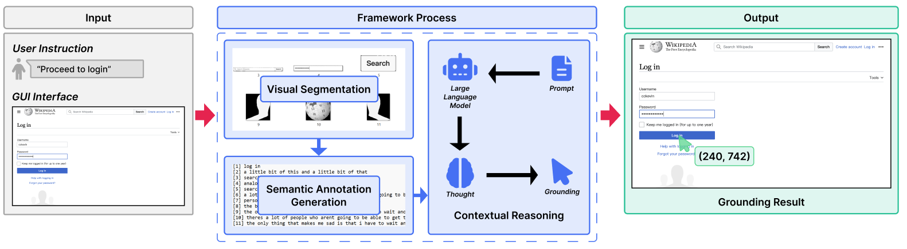
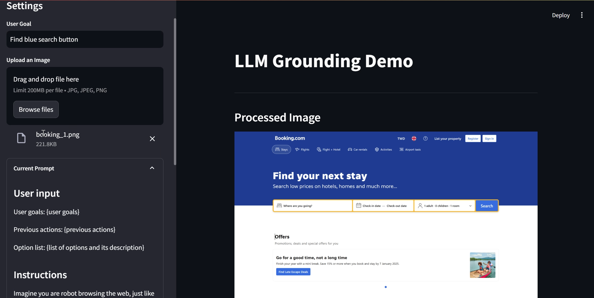

<!-- git remote add origin https|ssh:path/to/the/repository.git  -->
<!-- git pull origin main --rebase -->
<div align="center">
<h1> Advanced Visual-Only GUI Grounding Framework with Visual Segmentation Model and Large Language Model </h1>
<a href="https://github.com/krsx/visual-gui-grounding.git">
    
</a>
</div>

<!-- You can make badge by read on official documentation at https://shields.io/badges -->

<p align="center">
<a href="#-introduction">Introduction</a> &nbsp;&bull;&nbsp;
<a href="#-tech-stack">Tech Stack</a> &nbsp;&bull;&nbsp;
<a href="#%EF%B8%8F-installation">Installation</a> &nbsp;&bull;&nbsp;
<!-- <a href="#%EF%B8%8F-demo">Demo</a> &nbsp;&bull;&nbsp; -->
<a href="#-reference">Reference</a>&nbsp;&bull;&nbsp;
<a href="#-issue">Issue</a>&nbsp;&bull;&nbsp;
<a href="#-license">License</a>&nbsp;&bull;&nbsp;
<a href="#-author">I Putu Krisna Erlangga</a>
</p>

## 📄 Introduction

The expanding demand for autonomous agents highlights the necessity of effective GUI grounding to enable accurate interactions with graphical interfaces. Traditional methods often depend on extensive fine-tuning, large datasets, and high-cost hardware, restricting their accessibility. This research proposes a `visual-only GUI grounding framework that integrates visual segmentation models with large language models`, eliminating the need for fine-tuning. The framework leverages the `Segment Anything Model (SAM)` to segment GUI images into regions, which are then captioned using small language models like `BLIP`. State-of-the-art large language models, such as `GPT-4o`, analyze these captions to align user queries with relevant GUI elements. The evaluation, conducted on 350 GUI datasets across web, mobile, and desktop environments, demonstrates the framework's effectiveness. The proposed framework achieved an accuracy of 57.86%, acquiring a better performance than the 56.91% accuracy of `SeeClick` (GUI fine-tuned model), a fine-tuned GUI model. Our framework also surpasses the SoTA LLM model (`GPT-4o` and `GPT-4o-mini`) with margin up to 30%. These results underscore the framework's capability to perform robust GUI grounding without the need for fine-tuning, presenting a practical and efficient solution for diverse applications in GUI interaction.

## 💻 Tech Stack

> Framework, Library, Database, Tools, etc

<!-- You can search the logo with https://simpleicons.org and copy the name in logo=copyhere same with color after badge/YourText-YourColor-->

- Python
- PyTorch
- Streamlit
- HuggingFace
- OpenAI

## ⚙️ Installation

1. Clone this repository `https://github.com/krsx/visual-gui-grounding.git` or click `Clone or Download` button and then click `Download ZIP`
2. Install required the required library `pip install -r requirements.txt`
3. Setup your `.env`
   ```bash
   OPENAI_API_KEY=enter_your_api_key_here
   ```

## 🔎 Usage Guide

We provide a `streamlit app` for a convinient way to understand how the framework works. Run the app by using:

```bash
sreamlit run app.py
```

 

<br>
For framework evaluations, we provide 3 automated evaluations scripts. Here are step by step to use it:

1. Download [ScreenSpot](https://drive.google.com/drive/folders/1FuFT05yXOV_QxhwYft85YTLOgaIYm_fS) GUI datasets and annotations
2. To execute framework evaluation
   ```bash
   python eval.py --screenspot_imgs path/to/imgs --screenspot_test path/to/annotations--task all
   ```
3. To execute `SeeClick` and `Qwen-VL` evaluation
   ```bash
   python eval_seeclick.py --screenspot_imgs path/to/imgs --screenspot_test path/to/annotations--task all
   ```
   ```bash
   python eval_seeclick.py --screenspot_imgs path/to/imgs --screenspot_test path/to/annotations--task all --model qwen
   ```
4. To execute `GPT-4o` and `GPT-4o-mini` evaluation
`bash
    python eval_gpt.py --screenspot_imgs path/to/imgs --screenspot_test path/to/annotations --task all
    `
`bash
    python eval_gpt.py -screenspot_imgs path/to/imgs --screenspot_test path/to/annotations --task all --model gpt-4o-mini
    `
<!-- ## 📽️ Demo

<!-- If Needed  -->
<!-- <div align="center">
    
</div> -->

## 📚 Reference

<!-- If Needed -->

- [BLIP2](https://huggingface.co/docs/transformers/main/model_doc/blip-2#blip-2)
- [Segment Anything (SAM)](https://github.com/facebookresearch/segment-anything)
- [OpenAI](https://platform.openai.com/docs/overview)
- [HuggingFace](https://huggingface.co/models)
- [Streamlit](https://streamlit.io/)

## 🚩 Issue

If you found a bug or an issue, please report by opening a new issue on [this repository](<[https://github.com/zer0-911/paper-drone/issues](https://github.com/krsx/erina-bisindo-translator/issues)>).

## 📝 License

This project is licensed under the **MIT** License - see the [LICENSE](LICENSE) file for details

## 📌 Authors

<p align="center">
<h3> I Putu Krisna Erlangga </h3>
<a target="_blank" href="https://www.linkedin.com/in/krisna-erlangga/"></a>
<a target="_blank" href="https://github.com/krsx"></a>
<a target="_blank" href="https://krsx-dev.framer.website/">

</a>
</p>
